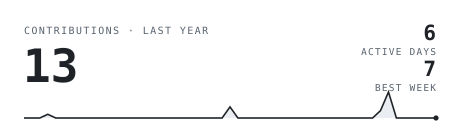
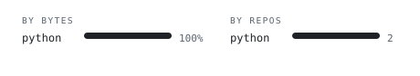
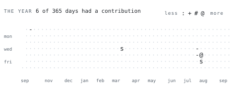

  

  

<a href="https://www.linkedin.com/in/alexander-petrakov-457291208/">linkedin</a>
&nbsp;&nbsp;·&nbsp;&nbsp;
<a href="https://www.instagram.com/petraisalex/">instagram</a>

 

> First-Class Finance graduate; incoming International Business MSc across Maastricht, Stellenbosch &amp; Aston.
> Financial engineering — where markets meet machine learning.

I build at the intersection of finance and AI: financial modeling, econometrics, data analytics, and machine learning, aimed at **wealth management, FP&A, and corporate development**. I turn messy problems into decisions, and translate fluently between technical and business stakeholders across international hubs.

<samp>python&nbsp; · &nbsp;sql&nbsp; · &nbsp;r&nbsp; · &nbsp;pandas&nbsp; · &nbsp;scikit-learn&nbsp; · &nbsp;excel&nbsp; · &nbsp;power bi&nbsp; · &nbsp;stata&nbsp; · &nbsp;javascript&nbsp; · &nbsp;git</samp>

**[portfolio-recommendation-engine](https://github.com/Petraialex/portfolio-recommendation-engine)** &nbsp;·&nbsp; <samp>python</samp>
Portfolio recommendation built as an end-to-end digital-business analysis — problem, data, solution.

**[blog-chart-spec](https://github.com/Petraialex/blog-chart-spec)** &nbsp;·&nbsp; <samp>python</samp>
Specification and tooling for the data-visualization figures in ModAstera blog posts.

**[petrakov-folio](https://github.com/Petraialex/petrakov-folio)** &nbsp;·&nbsp; <samp>javascript</samp>
Personal portfolio site.

 

 

Every graphic here is generated inside this repo — nothing is embedded from a third-party server, so nothing here can rate-limit or go dark.

`portrait.svg` is a photo pushed through a 13-character brightness ramp by `scripts/portrait.py`. The stat graphics and these section headings are drawn by [a scheduled action](.github/workflows/refresh.yml) straight from the GitHub GraphQL API, once a day, committing only what changed.

Everything is drawn to read correctly as a static image: GitHub renders README graphics as static (it runs no scripts or animation inside them), so nothing here depends on either. The headings are images too — GitHub strips CSS from README text, so an image is the only way to give them their own typeface.

Language totals cover public repositories only. `year.svg` uses the portrait's own ramp — `:` `+` `#` `@`, quiet to loud.
